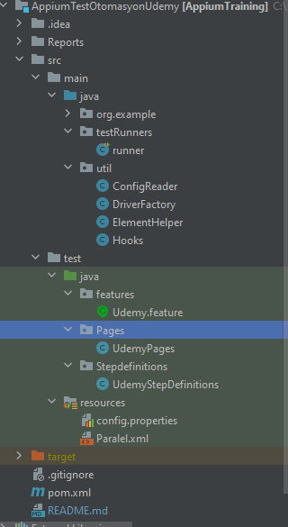

# AppiumTraining
Bu Repo Udemy Mobil Uygulamasının UI Testlerini Otomatize Gerçekleştirmek İçin Oluşturulmuştur.

**Kullanılan Araçlar ve Kütüphaneler** 
* Android Studio, Appium, JDK, Intellij IDEA
* Java, Cucumber, Maven, TestNG, Appium Driver

**Proje yapısını aşağıda ekran resmindeki gibi oluşturdum.**

* **runner** Testlerimizi yürütmek için runner classı başlangıç noktasıdır.

* **DriverFactory** sınıfı driver’ın genel özelliklerinin tanımlandığı sınıftır. Bu sınıf da driver için tanımlanan
diğer sınıfların özellikleri de kullanılır.

* **ElementHelper** sınıfında elemana tıklama, elemana yazı gönderme ve elemanın varlığını kontrol etme
gibi fonksiyonların yazıldığı sınıftır.

* **Hooks**, her test senaryomuzda senaryonun başlamadan önce ve senaryo bittikten sonra yapılması
gerekenlerin tanımlandığı sınıftır

* **config.properties** Driver’ın ayağa kaldırılırken kullanılması istenilen ayarların tanımlandığı dosyadır.
* **Paralel.xml** uygulama hangi tip Webdriver, uygulama nerden başlatılacağı ve paralel
test koşumu için tanımlamaların yapıldığı dosyadır.
* **Feature** : Uygulama senaryo adımlarının herhangi bir dil kullanarak tanımlanabildiği
dosyadır.

